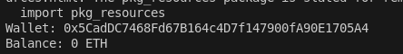
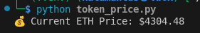

# web3_py3 Web3 Python Starter Kit 🚀

This repository contains Python scripts that interact with the Ethereum blockchain using [Web3.py](https://web3py.readthedocs.io/).  

I’m a backend developer expanding into Web3. This starter toolkit shows how to:  
- ✅ Fetch Ethereum wallet balances  
- ✅ Get live ETH price data  
- ✅ Interact with ERC-20 smart contracts (example: USDC)  

## ⚙️ Setup

1. Clone:
   ```bash
   git clone https://github.com/mamoje09/web3_py3.git
   cd web3_py3 

## 📂 Project Structure

web3_py3/
├── wallet_balance.py # Check ETH balance of a wallet
├── token_price.py # Get live ETH price (CoinGecko API)
├── interact_contract.py # Interact with ERC-20 contracts (USDC example)
├── requirements.txt # Dependencies
├── .env # Local environment variables
└── screenshots/ # Demo outputs

2. Create a virtual environment
   python3 -m venv .venv
   source .venv/bin/activate   # Linux/Mac
   .venv\Scripts\activate      # Windows

3. Install Dependencies
   pip install -r requirements.txt

4. Create a .env file
   WEB3_PROVIDER=https://mainnet.infura.io/v3/YOUR_PROJECT_ID
   WALLET_ADDRESS=0xYourEthereumWallet

5. Run the Scripts
   python wallet_balance.py
   python token_price.py
   python interact_contract.py


📸 Demo Output

**Wallet Balance Script**


**ETH Price Script**


**USDC Balance Script**


🛠 Roadmap

Add more ERC-20 contract

Fetch ERC-721 (NFT) balances

Build simple dApps using Python backends


📬 About Me

I’m exploring Web3 as a backend developer (Python, DevOps).
If you’re looking for a collaborator or contributor feel free to reach out!

https://github.com/mamoje09/web3_py3
GitHub: mamoje09

Email: mamoje09@gmail.com

Wallet: ETH wallet address - 0x55F3E949b552e32fF9B7238DFA760133F490c637
                           - 0x5CadDC7468Fd67B164c4D7f147900fA90E1705A4
